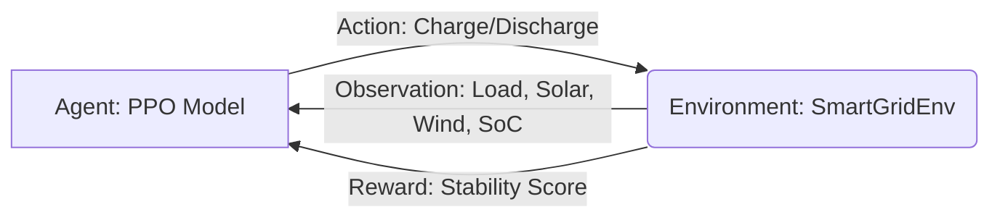

# Grid Stability AI: Technical Deep Dive & Project Review

This document provides a comprehensive technical breakdown of the **Grid Stability Optimisation** project. It explains the "how" and "why" behind every component, defining key terms used in the Reinforcement Learning (RL) and Power Systems contexts.

---

## 1. High-Level Architecture
The project follows a standard RL loop where an **Agent** interacts with an **Environment**.

---

## 2. Terminology & Key Components

### A. Reinforcement Learning (RL) Terms
*   **Agent (PPO)**: The "brain" of the system. We use **Proximal Policy Optimization (PPO)**, an industry-standard algorithm that balances exploration (trying new things) and exploitation (using known good strategies). It is particularly good for continuous control (like setting a precise battery charge rate).
*   **Observation Space**: What the agent "sees" at each step. In this project, it includes:
    *   **Load**: Total electrical demand from the grid.
    *   **Solar/Wind**: Current renewable energy production.
    *   **SoC (State of Charge)**: The current "fuel level" of the battery (0% to 100%).
    *   **Time Encoding (Sin/Cos)**: Helps the agent understand the 24-hour cycle (e.g., recognizing that peak demand usually happens in the evening).
*   **Action Space**: What the agent can "do". Our action is a continuous value between `-1` (full discharge) and `+1` (full charge).
*   **Reward Function**: The "goal" signal. The agent is trained to maximize this.
    *   *Our Logic*: We penalize the **Squared Grid Imbalance**. This means the agent gets a "punishment" if the grid draw is high. This forces it to use the battery to "shave" those peaks.

### B. Power System Terms
*   **Net Load**: The actual demand the grid must meet after using all available solar and wind power. `Net Load = Load - (Solar + Wind)`.
*   **Peak Shaving**: The process of using stored energy (battery) to reduce the maximum power demand from the utility grid during period of high consumption.
*   **Round-Trip Efficiency**: The percentage of energy that can be retrieved from the battery relative to the energy used to charge it. We use **95%** efficiency in our model.

---

## 3. Detailed Component Breakdown

### 🔋 The Battery Model (`battery.py`)
This is a physical simulation. It isn't just a "variable"; it calculates:
1.  **Power Limits**: You cannot charge faster than the battery's maximum rate.
2.  **Capacity Limits**: You cannot charge a full battery or discharge an empty one.
3.  **Efficiency Loss**: Energy is lost as heat during charging/discharging.

### 🌍 The Environment (`grid_env.py`)
This class acts as the bridge between raw data and the AI.
- It "plays" the historical data step-by-step (every 15 minutes).
- It calculates the **Balance Equation**:
  `Grid Net = Load - Solar - Wind + Battery Power`
- If `Grid Net` is zero, the system is perfectly stable.

### 🧠 The Trained Agent (`models/rl_models/`)
After training for 100,000+ steps, the model learns a **Policy**. This policy is a mathematical mapping that says: *"If the sun is setting and the load is rising, I should start discharging the battery now."*

### 📊 The Dashboard (`app.py` & `static/`)
A modern Flask-based UI that:
1.  Loads the trained model.
2.  Runs a "deterministic" simulation where the AI makes all the decisions.
3.  Sends the results (SoC, Power Flow) to the frontend via JSON.
4.  Visualizes the data using **Chart.js** for interactive analysis.

---

## 4. Final Project Review
**Current Status**: Professional, modular, and scientifically sound.

### Why it's "Premium":
- **Normalization**: Most beginners forget to normalize data. This project uses `VecNormalize`, which ensures the AI doesn't get "confused" by different scales (e.g., Load in thousands vs SoC in decimals).
- **Time Encoding**: Using Sine/Cosine for time is a sophisticated trick that helps neural networks understand cyclicality without a "jump" from 23:59 to 00:00.
- **Modern UI**: The dashboard isn't just functional; it uses **Glassmorphism** and a **Dark Theme** to provide a high-end user experience.

### Suggested Next Steps:
- **Multi-Battery Support**: Simulate a fleet of batteries.
- **Carbon Intensity**: Train the agent to specifically optimize for *low carbon* hours rather than just *flat* hours.
